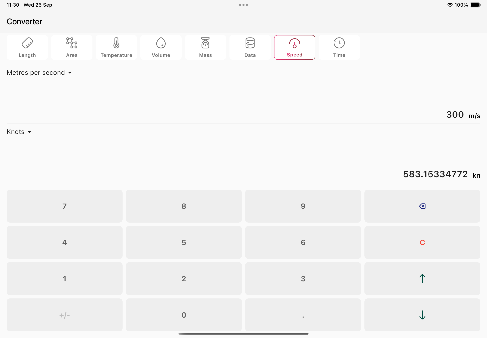

# Unit Converter

Unit converter app built with `Rust` and `Flutter`. It allows for conversion of values from one unit to another.

## Screenshots
<table>
  <tr>
    <td></td>
    <td></td>
    <td></td>
  </tr>
</table>
<table>
  <tr>
    <td></td>
    <td></td>
  </tr>
</table>

## Available Units

### Length
- Millimetres
- Centimetres
- Metres
- Kilometres
- Inches
- Feet
- Yards
- Miles
- Nautical miles
- Mils

### Area
- Acres
- Ares
- Hectares
- Square centimetres
- Square feet
- Square inches
- Square metres

### Temperature
- Celcius
- Fahrenheit
- Kelvin

### Volume
- UK gallons
- US gallons
- Litres
- Millilitres
- Cubic centimetres
- Cubic metres
- Cubic inches
- Cubic feet

### Mass
- Tonnes
- UK tons
- US tons
- Pounds
- Ounces
- Kilogrammes
- Grams

### Data
- Bits
- Bytes
- Kilobytes
- Kibibytes
- Megabytes
- Mebibytes
- Gigabytes
- Gibibytes
- Terabytes
- Tebibytes

### Speed
- Metres per second
- Metres per hour
- Kilometres per second
- Kilometres per hour
- Inches per second
- Inches per hour
- Feet per second
- Feet per hour
- Miles per second
- Miles per hour
- Knots

### Time
- Milliseconds
- Seconds
- Minutes
- Hours
- Days
- Weeks